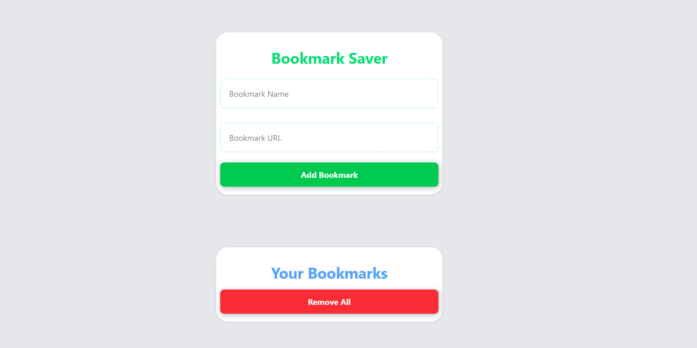

## Project Name: Bookmark Saver
 This is is minimal bookmark saver intented to solve my issue of cluttering my browser. Using own creation feels just amazing.

## Features
- Add bookmark with your URL.
- Local Storage to save all your links.
- Beautiful UI (Even Blamed for using AI, but no I really took my time building this)
- Remove All button to remove every other bookmark
- Individual Remove button to remove each of the button.

## Future Scaling
- Adding animation response on addition/removal of bookmark as in hackatime. (dont know how to create)
- Warning Dialouge box when clicking reset all button.


## Main difficulty faced
I was assiging the id generated by ``` id = Date.now() ``` in the ``` <template></template>``` tag. Due to this logic of the individual remove button was breaking. Also the layout I wanted to acheive for individual bookmark was not acheived.

## Solution Created
- I didn't use the ``` id ``` logic rather kept the storage simple with URL Name and URL itself. 
- I changed the layout into more simpler version and added ```window.open(link,"_blank") ```


 ## Tech Stack
 - HTML
 - Tailwind CSS (Yes, I learned it! Took a whole day though. Yet, can't do many things.)
 - JS


 